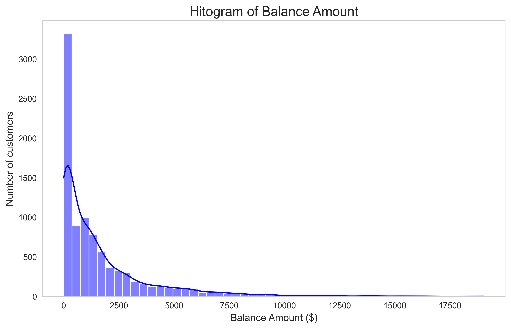
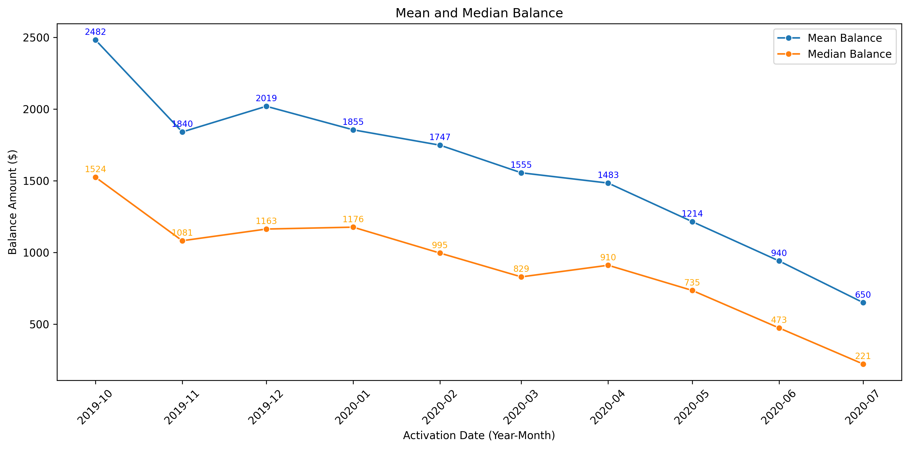
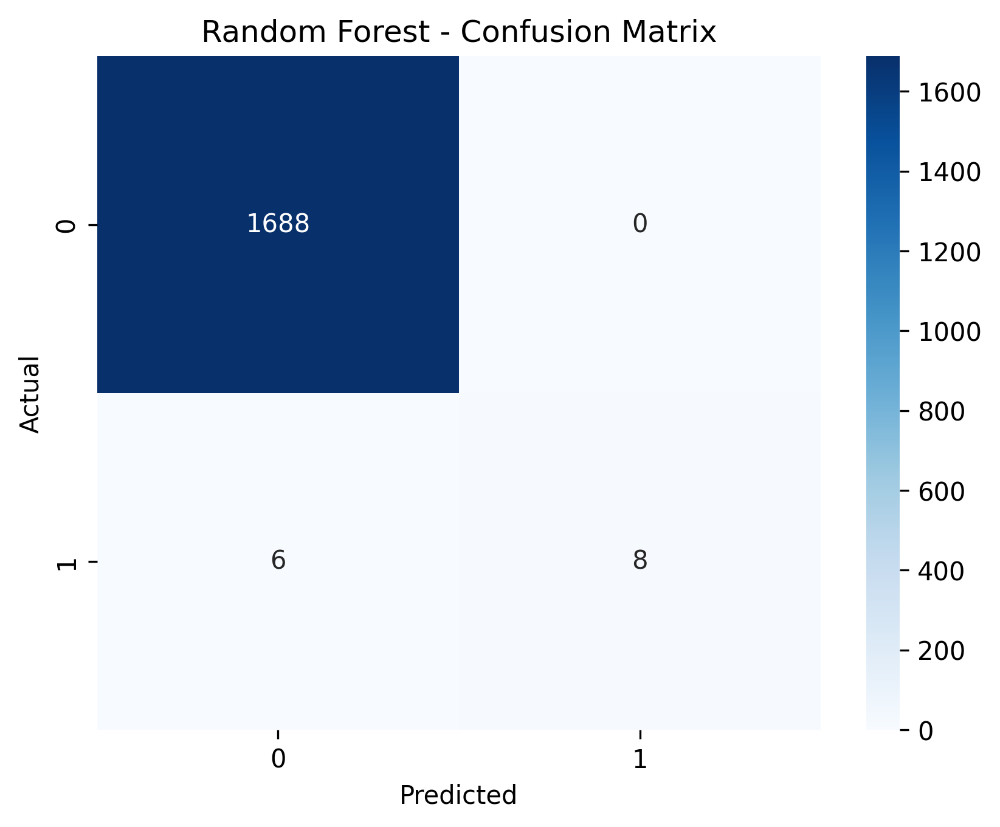

# 🕵️‍♀️ Credit Card Fraud Detection – Stori Data Science Test

This project aims to build a supervised machine learning model to predict fraudulent credit card transactions, using a modified version of the [original Kaggle dataset](https://www.kaggle.com/datasets/arjunbhasin2013/ccdata/data).
## 📁 Project Pipeline
In order to run the model train script. Run the p01_pipeline_training.py python file in the [pipeline file](https://github.com/JuanAntonioRe/Credit_Card_Fraud/tree/main/pipeline)

In order to run the EDA script. Run the p02_pipeline_eda.py in the [pipeline file](https://github.com/JuanAntonioRe/Credit_Card_Fraud/tree/main/pipeline)

If you want to see a more detailed EDA. You can open the EDA.ipynb 

## 📊 Dataset Description

In addition to the original Kaggle features, the dataset used in this project includes:

- `activated_date` (activation date)
- `last_payment` (last payment date)
- `fraud` (target variable, boolean)

The target variable `fraud` is **highly imbalanced**:
- **8880** non-fraud cases (0)
- **70** fraud cases (1)

## ✅ Tasks Completed

### 📌 Question 1: Exploratory Data Analysis
- Histogram of balance amounts.
- Report any structure finded and hypotheses.
- Mean and Median balance report.
- Report any structure finded and hypotheses.

### 📌 Question 2: Customer Report (2020)
- Generated a filtered table with the following:
  - `cust_id` (numeric only)
  - `activated_date` (YYYY-MM)
  - `last_payment` (YYYY-MM-DD)
  - `cash_advance`
  - `credit_limit`
  - `cash_advance` as % of `credit_limit`

### 📌 Fraud Prediction Model

- Stratified train/test split
- Feature scaling
- Models evaluated:
  - Random Forest (using class-weigth parameter in order to mange the unbalanced data)
- Evaluation techniques:
  - 5-Fold Cross-Validation
  - Confusion Matrix
  - F1-Score
  - ROC-AUC
  - Feature importance analysis

## 📈 Questions Results

1. Histogram of balance amounts.
   
   

The histogram of Balance Amount shows a strong right-skewed distribution, with the majority of customers concentrated near the lower end of the scale
* Over 3,000 customers have balances close to zero balance. This could be indicate:
  * Customers who pay their credit card in full each month.
  * Recently activated accounts with little or no usage.
  * Inactive accounts or customers who rarely use their credit card.
* There is a long tail extending toward higher balance values, indicating the presence of customers with significantly larger outstanding balances, though they are much fewer in number.

**Hypotheses**
* The skew may reflect responsible usage. Customers avoid carrying large balances
* Credit limit in new customers or high-risk customers
* There are customers that recently have activated their accounts
* Very high balances could be a fraud

2. Mean and Median balance



* The Mean Balance is higher than the Meadian Balance, this reinforces the earlier finding: the right-skewed distribution, with a minority of customers holding significantly larger balances.
* There are not abrupt jumps or discontinuities, this suggest stable customer acquisition and creditusage patterns over time.

**Hypotheses**
* The gap between mean and median is likely caused by a few customers with very high balances, which inflate the mean.
* Customers acquired in late 2019 may have had more active credit behavior, while those acquired in 2020 may have had more conservative usage, contributing to the overall decline in balance.
* The downward trend from 2019 to 2020 could be related to the early pandemic period, during which credit usage may have dropped due to economic uncertainty or changing consumer behavior.

3. Filtered Table

The filtered table is saved as a csv file and as a xlsx file.

## 📈 Model Results

**Confusion Matrix**



1. Key Findings
    - Perfect accuracy (100%) for class 0 (Non-Fraud): The model correctly identifies all legitimate transactions, which is expected due to extreme class imbalance
    - High precision (100%) for class 1 (Fraud): Every prediction labeled as "Fraud" is correct (no false positives).
    - Low recall (57%) for Fraud: Only 57% of actual fraud cases are detected, meaning 43% of frauds are missed (false negatives).
2. Critical Issues
    - Moderate F1-Score (0.73) for Fraud: Reflects the trade-off between precision and recall. The cross-validation F1 (0.65 ± 0.04) indicates instability on unseen data.
    - Misleading ROC-AUC (0.92): While the AUC seems high, it’s skewed by the majority class performance and doesn’t guarantee good fraud detection.
3. Recommendations for Improvement
    - Use oversampling (SMOTE) to address class imbalance.
    - **Increase recall (capture more frauds):** Adjust the classification threshold (e.g., lower the probability threshold for "Fraud").
    - **Experiment with alternative models:** XGBoost/LightGBM with scale_pos_weight for imbalance.
4. Most important features: `payments`, `purchases`, `credit_limit`, and `minimum_payments`.

## 🚀 Requirements

```bash
pip install -r requirements.txt
```

Or manually install:

- pandas  
- numpy  
- matplotlib  
- scikit-learn 

## 🧠 Conclusions

- The dataset is highly imbalanced, requiring careful handling of minority class.
- Random Forest showed strong generalization with minimal overfitting.
